# jaxphys

[](https://github.com/sushaan-k/jaxphys/actions)
[](https://pypi.org/project/jaxphys/)
[](https://pypi.org/project/jaxphys/)
[](https://www.python.org/downloads/)
[](https://github.com/google/jax)
[](LICENSE)

**GPU-accelerated differentiable physics engine built on JAX.**

---

## At a Glance

- Classical, EM, quantum, fluids, optics, and statistical mechanics modules
- JAX-native autodiff and JIT compilation throughout the simulation stack
- Symplectic integrators, FDTD/FDFD fields, wave mechanics, SPH and
  finite-volume fluids, tight-binding bands, and Ising Monte Carlo
- Physics tests check solvers against analytic or independent results (Sod shock tube,
  free-space Green's function, Poiseuille flow, PML reflection, exact Ising enumeration)
- Examples, notebooks, and visualization tools for research and teaching

## The Problem

Physics simulation libraries fall into two camps:

1. **Research-grade** (FEniCS, OpenFOAM, COMSOL) — powerful but massive C++/Fortran codebases, impossible to install, and not differentiable.
2. **Educational** (VPython, PhysicsJS) — toy-level, CPU-only, not useful for real computation.

There's a massive gap for a **modern, GPU-accelerated, differentiable physics library in Python** that's actually usable for research, optimization, and education.

## The Solution

`jaxphys` is a JAX-based differentiable physics engine covering **classical mechanics, electromagnetism, quantum mechanics, fluids, optics, and statistical mechanics** with GPU acceleration and automatic differentiation built in.

**Key features:**
- Define a Lagrangian, get equations of motion automatically via JAX autodiff
- Symplectic integrators whose energy error stays bounded over long runs
- FDTD Maxwell solvers (2D and 3D) with split-field PML absorbing boundaries, and a differentiable FDFD solver for inverse design
- Split-operator Schrödinger solvers in 1D and 2D (exactly unitary)
- SPH, compressible Euler, lattice Boltzmann and vorticity-streamfunction fluid solvers
- Tight-binding band structures with gradients with respect to the hoppings
- Ising model Monte Carlo with checkerboard Metropolis and Wolff cluster updates, vectorized over temperatures
- Simulations run under `jax.jit`, `jax.vmap` and `jax.grad`: optimize through entire trajectories
- Vectorized parameter sweeps for coarse search before local optimization

## Benchmarks

| Simulation | NumPy | jaxphys (JIT) | Speedup |
|---|---|---|---|
| N-body, velocity Verlet (N=1000, 200 steps) | 12.64 s | 0.78 s | 16.3x |
| Schrödinger 2D, split-operator (256×256, 500 steps) | 1.20 s | 0.72 s | 1.7x |
| SPH, weakly compressible (4096 particles, 200 steps) | 2.34 s | 3.63 s | 0.6x |
| FDTD 3D Yee + split-field PML (64³, 200 steps) | 6.20 s | 0.74 s | 8.4x |

*Measured on CPU only: a cloud container with 4 logical cores of an Intel
Xeon @ 2.80GHz (jax 0.10.2, NumPy 2.4.6, float64), shared with other jobs, so
expect run-to-run variation (an earlier run of the same FDTD code took
1.74 s). No GPU numbers have been measured. The NumPy columns are
straightforward vectorized implementations of the same schemes (the SPH
baseline finds neighbours with SciPy's compiled `cKDTree`, which is why it
wins on CPU); every row asserts that both final states agree before timing.
JAX times exclude the first (compiling) call and use `block_until_ready()`.
Reproduce with `python examples/bench.py` (`--quick` for a fast smoke run).
A larger suite with per-solver timings, compile times and vmap scaling is in
[docs/benchmarks.md](docs/benchmarks.md).*

### Validation

`python -m benchmarks.run` also runs physics checks against analytic or
independent results (full run, CPU; details and reproduce commands in
[docs/benchmarks.md](docs/benchmarks.md)):

| Check | Result |
|---|---|
| Energy error, Kepler orbit (e = 0.5), 1000 orbits | leapfrog 2.7e-3 and Yoshida-4 9.2e-6, bounded (same maximum in both halves of the run); RK4 drifts linearly (4.6e-4 in the first half, 9.3e-4 in the second) |
| Convergence order (oscillator / Kepler) | Euler 1.02 / 1.00, symplectic Euler 1.01 / 1.00, leapfrog 2.00 / 2.00, Yoshida-4 4.00 / 4.00, RK4 4.01 / 4.02 |
| Ising T_c from Binder-cumulant crossings (L = 16 / 32) | 2.2683 ± 0.0104 vs Onsager 2.2692; Wolff and Metropolis energies agree (z = 0.23 at T = 2, 0.93 at T = 3) |
| FDTD PEC cavity, modes 1-4 | within 6.7e-5 of the Yee dispersion relation |
| Schrödinger | norm conserved to 2.5e-12 over 20000 steps; free Gaussian packet matches the exact solution to 3.8e-13 |
| LBM channel | shear-mode decay rate within 0.22% / 0.05% / 0.01% (H = 16 / 32 / 64, second order); driven channel reaches a steady Poiseuille profile (0.08% from the parabola, dp/dx 0.8% from -12 μ u / H²) with mass flux conserved to 2e-11 |
| Sod shock tube (1D Euler) | density L1 error 2.4e-3 at 400 cells, 7.8e-4 at 1600 |
| FDFD line source vs Hankel Green's function | max error 0.7% at 30 points per wavelength |
| `jax.grad` through `simulate()` vs central finite differences | relative differences 2.5e-10 to 1.3e-8 |

## Supported Domains

| Domain | Solvers | Differentiable | GPU |
|---|---|---|---|
| Classical mechanics | Lagrangian/Hamiltonian systems with symplectic Euler, leapfrog (Störmer-Verlet), Yoshida-4, RK4, Euler; velocity-Verlet N-body; rigid bodies; adaptive RK45 stepper | ✅ | ✅ |
| Quantum | Split-operator Schrödinger (1D, 2D), finite-difference eigenstates, tight-binding bands, Heisenberg spin chains (exact diagonalization), Lindblad master equation | ✅ | ✅ |
| Electromagnetism | FDTD (2D TM, 3D) with split-field PML, FDFD (2D TM) with stretched-coordinate PML, Boris-pushed charges, rectangular waveguide modes | ✅ | ✅ |
| Fluid dynamics | Weakly compressible SPH, compressible Euler (1D MUSCL-HLLC), lattice Boltzmann (D2Q9), vorticity-streamfunction Navier-Stokes | ✅ | ✅ |
| Statistical mechanics | Ising Metropolis (checkerboard) and Wolff cluster Monte Carlo, Boltzmann statistics | Boltzmann only (Monte Carlo sampling is not differentiable) | ✅ |
| Optics | ABCD ray tracing, Fraunhofer diffraction | ✅ | ✅ |

"GPU" means the solver is pure JAX and runs on any JAX backend; the
benchmarks above were measured on CPU only. `adaptive_rk45` and the
plotting helpers run on the host.

## Quick Start

```bash
pip install jaxphys
```

### Double Pendulum (Lagrangian Mechanics)

```python
import jaxphys as jp
import jax.numpy as jnp

def lagrangian(q, qdot, params):
    theta1, theta2 = q
    omega1, omega2 = qdot
    m1, m2, l1, l2, g = params.m1, params.m2, params.l1, params.l2, params.g

    T = (0.5 * m1 * (l1 * omega1)**2 +
         0.5 * m2 * ((l1 * omega1)**2 + (l2 * omega2)**2 +
         2 * l1 * l2 * omega1 * omega2 * jnp.cos(theta1 - theta2)))
    V = (-(m1 + m2) * g * l1 * jnp.cos(theta1) -
         m2 * g * l2 * jnp.cos(theta2))
    return T - V

system = jp.LagrangianSystem(lagrangian, n_dof=2)
params = jp.Params(m1=1.0, m2=1.0, l1=1.0, l2=1.0, g=9.81)

trajectory = system.simulate(
    q0=[jnp.pi/4, jnp.pi/2],
    qdot0=[0.0, 0.0],
    t_span=(0, 30),
    dt=0.001,
    params=params,
    integrator="rk4",
)

print(f"Energy drift: {trajectory.energy_drift():.2e}")
```

### Gradient-Based Optimization

```python
import jax
import jax.numpy as jnp
import jaxphys as jp

# Find initial velocity to land a projectile at x=100
def miss_distance(v0):
    traj = jp.projectile(v0=v0, angle=45.0)
    return (traj.final_position - 100.0)**2

# Compute sensitivity: how does v0 affect range?
d_range_dv0 = jax.grad(lambda v0: jp.projectile(v0=v0).range)(30.0)
print(f"Range sensitivity: {d_range_dv0:.4f}")

# Optimize through entire trajectory
result = jp.optimize(miss_distance, initial_guess=10.0, learning_rate=0.001)
print(f"Optimal v0: {result.x:.4f}")  # sqrt(100 * 9.81) = 31.32 m/s

# Coarse scan launch speed and angle before local refinement
grid = jp.make_parameter_grid(
    {
        "v0": jnp.linspace(20.0, 45.0, 26),
        "angle": jnp.linspace(25.0, 65.0, 17),
    }
)
sweep = jp.parameter_sweep(
    lambda params: jp.projectile(v0=params[0], angle=params[1]).range,
    grid.values,
    objective=lambda range_m: (range_m - 100.0) ** 2,
    batch_size=64,
)
print(grid.as_dict(sweep.best_index), sweep.best_score)

def objective(params):
    return (jp.projectile(v0=params[0], angle=params[1]).range - 100.0) ** 2

refined = jp.refine_parameter_sweep(
    objective,
    sweep,
    top_k=3,
    learning_rate=0.01,
    max_iterations=500,
)
print(refined.best_parameters, refined.best_score)
```

### Quantum Tunneling

```python
import jaxphys as jp

barrier = jp.SquareBarrier(height=5.0, width=1.0, center=10.0)
psi0 = jp.GaussianWavepacket(x0=5.0, k0=3.0, sigma=0.5)

result = jp.solve_schrodinger(
    psi0=psi0, potential=barrier,
    x_range=(-5, 25), t_span=(0, 10), n_points=1000,
)

print(f"Transmission coefficient: {result.transmission_coefficient:.4f}")
```

### Waves, Bands and Fluids

```python
import jax
import jax.numpy as jnp
import jaxphys as jp

# Graphene bands: the Dirac point at the zone corner K has zero energy.
graphene = jp.TightBinding.honeycomb(t=2.7)
b1, b2 = graphene.reciprocal_vectors
print(graphene.bands((2 * b1 + b2) / 3))  # ~[[0, 0]]

# FDFD: field of a line current, differentiable w.r.t. the permittivity map.
eps = jnp.ones((80, 80))
current = jnp.zeros((80, 80)).at[40, 40].set(1.0)
probe = lambda e: jnp.abs(jp.solve_fdfd(e, current, 3e9, 5e-3).ez[60, 40]) ** 2
sensitivity_map = jax.grad(probe)(eps)  # d|Ez|^2 / d eps_r at every cell

# Sod shock tube with the compressible Euler solver.
x = (jnp.arange(400) + 0.5) / 400
left = x < 0.5
sod = jp.solve_euler_1d(
    jnp.where(left, 1.0, 0.125), jnp.zeros(400), jnp.where(left, 1.0, 0.1),
    dx=1 / 400, t_end=0.2,
)
print(f"Post-shock density: {float(sod.rho[-1, 300]):.3f}")  # exact: 0.266
```

## Architecture

```mermaid
graph TD
    A[jaxphys] --> B[Classical Mechanics]
    A --> C[Electromagnetism]
    A --> D[Quantum Mechanics]
    A --> E[Statistical Mechanics]
    A --> F[Optics]
    A --> G[Optimization]
    A --> I[Fluids]

    B --> B1[Lagrangian Engine]
    B --> B2[Hamiltonian Engine]
    B --> B3[N-Body Simulator]
    B --> B4[Rigid Body Dynamics]
    B --> B5[Symplectic Integrators]

    C --> C1[FDTD Maxwell Solver 2D/3D]
    C --> C4[FDFD Solver]
    C --> C2[Charge Dynamics]
    C --> C3[Waveguide Analysis]

    D --> D1[Schrodinger Solver 1D/2D]
    D --> D2[Eigenvalue Problems]
    D --> D5[Tight-Binding Bands]
    D --> D3[Spin Chains]
    D --> D4[Density Matrices]

    I --> I1[Lattice Boltzmann]
    I --> I2[Vorticity-Streamfunction NS]
    I --> I3[SPH]
    I --> I4[Compressible Euler]

    E --> E1[Ising Model]
    E --> E2[Monte Carlo Methods]
    E --> E3[Boltzmann Statistics]

    F --> F1[Ray Tracing ABCD]
    F --> F2[Fraunhofer Diffraction]

    H[JAX Backend] --> H1[jax.grad - Autodiff]
    H --> H2[jax.jit - Compilation]
    H --> H3[jax.vmap - Vectorization]
    H --> H4[jax.lax.scan - Efficient Loops]

    B1 -.-> H
    C1 -.-> H
    D1 -.-> H
    E1 -.-> H
    I3 -.-> H
```



## API Reference

### Core Modules

| Module | Description | Key Classes |
|--------|-------------|-------------|
| `jaxphys.classical` | Lagrangian/Hamiltonian mechanics, N-body, rigid body | `LagrangianSystem`, `HamiltonianSystem`, `NBody`, `RigidBody` |
| `jaxphys.em` | FDTD and FDFD Maxwell solvers, charge dynamics, waveguides | `EMGrid`, `EMGrid3D`, `solve_fdfd`, `ChargeSystem`, `RectangularWaveguide` |
| `jaxphys.quantum` | Schrödinger equation (1D/2D), eigenstates, tight-binding, spin chains, density matrices | `solve_schrodinger`, `solve_schrodinger_2d`, `TightBinding`, `SpinChain`, `DensityMatrix` |
| `jaxphys.fluids` | Lattice Boltzmann, vorticity-streamfunction NS, SPH, compressible Euler | `LBMGrid`, `NavierStokesSolver`, `SPHFluid`, `solve_euler_1d` |
| `jaxphys.statmech` | Ising model, Monte Carlo, Boltzmann statistics | `IsingLattice`, `boltzmann_distribution` |
| `jaxphys.optics` | Geometric ray tracing, Fraunhofer diffraction | `ThinLens`, `single_slit`, `double_slit` |
| `jaxphys.optimize` | Inverse problems, gradient-based optimization, grid search | `optimize`, `sensitivity`, `parameter_sweep`, `refine_parameter_sweep` |
| `jaxphys.viz` | Phase space plots, animations, field visualization | `plot_phase_space`, `animate_pendulum` |

### Integrators

| Integrator | Order | Symplectic | Best For |
|-----------|-------|------------|----------|
| `euler` | 1st | No | Baseline only |
| `symplectic_euler` | 1st | Yes | Quick prototyping |
| `leapfrog` | 2nd | Yes | General Hamiltonian systems |
| `velocity_verlet` | 2nd | Yes | N-body problems (takes an acceleration function; used by `NBody`) |
| `yoshida4` | 4th | Yes | High-accuracy long-time integration |
| `rk4` | 4th | No | Non-Hamiltonian or short-time; the default for `LagrangianSystem` |
| `stormer_verlet` | 2nd | Yes | Alias for leapfrog |
| `adaptive_rk45` | 5(4) | No | One error-controlled step at a time from a Python loop (not usable in `simulate`) |

The symplectic integrators assume separable Hamilton equations, so
`LagrangianSystem.simulate` accepts `euler` and `rk4` only; use a
`HamiltonianSystem` for symplectic integration.

## The Differentiable Advantage

Because everything runs on JAX, you get automatic differentiation through entire simulations:

- **Inverse problems**: Find parameters that produce desired behavior
- **Sensitivity analysis**: How does changing one parameter affect the whole system?
- **Optimization**: Find optimal configurations (spacecraft trajectories, lens designs)
- **Neural ODEs**: Combine physics with learned dynamics

## Examples

See the `examples/` directory:

- `double_pendulum.py` — Chaotic dynamics with energy conservation verification
- `three_body.py` — Sun-Jupiter-Earth gravitational system
- `quantum_tunneling.py` — Wavepacket tunneling through a barrier with transmission coefficients
- `em_diffraction.py` — FDTD slit diffraction with an EM source and screen
- `em_dipole_3d.py` — 3D FDTD dipole radiation into a PML-terminated box
- `ising_phase_transition.py` — Temperature sweep across the 2D Ising critical point
- `karman_vortex_street.py` — Lattice Boltzmann flow past a cylinder
- `spacecraft_trajectory.py` — Differentiable launch targeting on a lunar-gravity profile
- `bench.py` — The benchmark table above, checked against NumPy references

Run the offline walkthrough with:

```bash
uv run python examples/demo.py
```

For richer simulations, notebooks, and plots, see `examples/` and `notebooks/`.

## Development

```bash
# Clone and install in development mode
git clone https://github.com/sushaan-k/jaxphys.git
cd jaxphys
pip install -e ".[all]"

# Run tests
pytest tests/ -v

# Lint
ruff check src tests examples benchmarks
ruff format src tests examples benchmarks

# Type check
mypy src/jaxphys/

# Benchmark + validation suite (writes benchmarks/results/)
JAX_PLATFORMS=cpu python -m benchmarks.run --quick
```

## Performance Notes

- Every simulation loop is one compiled `jax.lax.scan`; only the saved snapshots are stored, and reverse-mode gradients recompute the steps between them instead of storing every step
- JIT compilation: the first call compiles, later calls with the same shapes reuse the compiled loop, including calls with new parameter values (masses, charges, inertia, temperatures, fluid constants are traced arguments); `tests/test_performance.py` checks that repeated calls trigger zero compilations
- N-body forces are computed on per-component (N, N) planes with `rsqrt`; SPH uses a cell list, so its cost grows linearly with the particle count
- Ising temperature sweeps run as one `jax.vmap`-ed batch of chains
- For GPU: install JAX with CUDA support, e.g. `pip install -U "jax[cuda12]"`

## Research References

- Goldstein, Poole, Safko. *Classical Mechanics* (2002)
- Griffiths. *Introduction to Electrodynamics* (2017)
- Griffiths. *Introduction to Quantum Mechanics* (2018)
- Taflove & Hagness. *Computational Electrodynamics* (2005)
- Newman & Barkema. *Monte Carlo Methods in Statistical Physics* (1999)
- Hairer, Lubich, Wanner. *Geometric Numerical Integration* (2006)

## Contributing

Contributions are welcome. Please:

1. Fork the repository
2. Create a feature branch
3. Add tests for new functionality
4. Ensure `pytest`, `ruff check`, and `mypy` pass
5. Open a pull request

## License

MIT License. See [LICENSE](LICENSE) for details.
